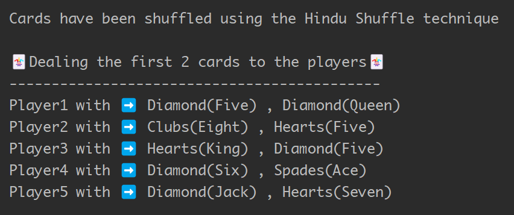
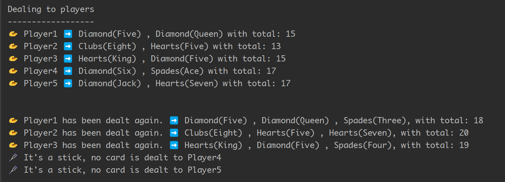
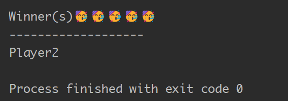

[](https://shields.io/)
[](https://shields.io/)

## Requirement
```sh
scala sbt
```

## Run test

```sh
sbt test
```

# THE BLACK JACK GAME DOMAIN MODEL
<hr>
Blackjack is a game of cards using a standard deck of cards of 4 suits 
(Hearts, Diamonds, Clubs and Spades), each of which has the 
following cards (2, 3, 4, 5, 6, 7, 8, 9, 10, Jack, Queen, King, Ace), and 
a Deck of cards consists of one of each combination (2 of Hearts, 2 of 
Diamonds, 2 of Clubs, etc).


In the game Blackjack, the cards have the following values:
  * 2-10: The value of the card number
  * Jack, Queen and King: 10
  * Ace: 11


### GAME RULES
<hr>
Assume there are 3 players. The aim of the game is to collect cards so 
that the total of an individual player’s cards does not exceed 21. At the 
end of the game the player with the total closest to 21 wins.
At the start of the game, the deck is shuffled (i.e. the order of the cards 
is randomized) and each player is immediately dealt a “hand” of two 
cards from the top of the deck.

Each player then takes turns to play. In a turn, the player uses the 
following strategy to play the game:
  * If the player's total is less than 17, they "hit" (i.e. get dealt 
  another card from the top of the deck).
  * If the player's total is 17 or greater, they "stick" (i.e. don't get 
  dealt another card).
  * If the player's total is greater than 21, they "go bust" (i.e. are 
  ejected from the game).
  The game finishes if:
  * All players "stick" in a round.
  * Any player hits 21 exactly.
  * There is only one player is left in the game because all others 
have "gone bust".


At the end of the game, if the game has not finished due to a player 
hitting 21, the player with the total closest (but still under) 21 wins.

### Screenshots
<hr>


<hr>



<hr>

